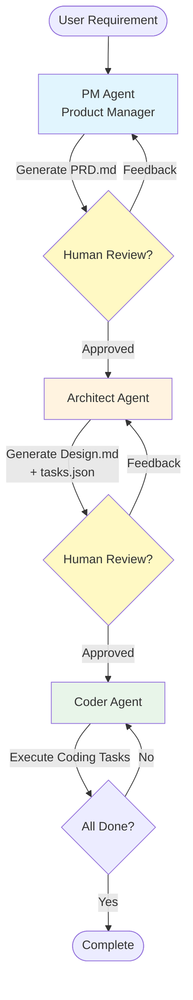

# AutoDev Agents

A LangGraph + Claude Code multi-agent system for automated software development.

[中文文档](README_CN.md) | English Documentation

## Overview

This project implements a Manager-Worker architecture where:
- **LangGraph** acts as the Manager (orchestrates workflow, manages state, makes routing decisions)
- **Claude Code CLI** acts as the Worker (executes coding tasks via CLI)

The system takes a requirement and generates:
1. Product Requirements Document (PRD)
2. Technical Design Document
3. Working code implementation

### Workflow Diagram



**Workflow Steps:**
1. **PM Agent** generates Product Requirements Document (PRD.md)
2. Human review checkpoint: modify PRD or provide feedback
3. **Architect Agent** creates Technical Design (Design.md) and task breakdown (tasks.json)
4. Human review checkpoint: modify design or task list
5. **Coder Agent** loops through coding tasks until completion

## Project Structure

```
autodev-agents/
├── src/
│   ├── main.py                           # Entry point CLI
│   ├── config/
│   │   ├── settings.py                   # Configuration & env management
│   │   └── prompts.py                    # Agent prompt templates
│   ├── core/
│   │   ├── state.py                      # AgentState TypedDict
│   │   ├── graph.py                      # LangGraph workflow definition
│   │   └── checkpoint_manager.py         # Checkpoint setup
│   ├── agents/
│   │   ├── base.py                       # Base agent class
│   │   ├── pm_agent.py                   # PRD generation
│   │   ├── review_agent.py               # PRD review
│   │   ├── architect_agent.py            # Technical design
│   │   ├── coder_agent.py                # Code execution loop
│   │   ├── qa_agent.py                   # Testing
│   │   └── bug_fix_agent.py              # Bug resolution
│   ├── tools/
│   │   ├── claude_cli.py                 # Claude Code CLI wrapper
│   │   ├── file_ops.py                   # File operations
│   │   └── validation.py                 # Output validators
│   └── utils/
│       ├── logger.py                     # Structured logging
│       └── helpers.py                    # Utilities
├── workspace/                            # Working directory for generated files
├── tests/
│   ├── test_agents/
│   ├── test_tools/
│   └── fixtures/
├── examples/
│   └── simple_todo_app.py                # Example workflow
├── pyproject.toml
├── requirements.txt
├── .env.example
└── README.md
```

## Installation

1. Clone the repository:
```bash
git clone <repository-url>
cd autodev-agents
```

2. Install dependencies:
```bash
pip install -e ".[dev]"
```

3. Set up environment variables:
```bash
cp .env.example .env
# Edit .env and add your ANTHROPIC_API_KEY
```

## Usage

### Start a New Project (Automatic Mode - Default)

```bash
# Default: automatic execution without human review
python -m src.main start "Build a simple Python CLI todo app with JSON storage"
```

The system will automatically:
1. Generate a PRD
2. Generate a Technical Design
3. Execute the implementation

### Enable Human Review Mode

```bash
# Add --human-loop flag to enable human review at PRD and Design stages
python -m src.main start "Build a simple Python CLI todo app" --human-loop
```

With human review enabled, the system will pause after:
1. PRD generation → review and continue
2. Technical Design generation → review and continue
3. Execute the implementation

### Specify Project Directory

```bash
# Use --project-dir or -d to specify an existing project directory
# Code will be generated in the specified directory instead of default workspace
python -m src.main start "Add user authentication" --project-dir /path/to/my/project

# Short form
python -m src.main start "Fix login bug" -d /path/to/my/project
```

**Important notes:**
- The project directory must exist (system will check)
- Claude Code will use `--add-dir` parameter pointing to this directory
- Generated code will be written directly to the specified project directory

### Resume from Checkpoint

```bash
# After reviewing artifacts, continue the workflow
python -m src.main continue
```

### Check Status

```bash
# Show current state of a session
python -m src.main status <session_id>
```

## Architecture

### Agents (MVP)

1. **PM Agent**: Generates PRD from requirements
2. **Architect Agent**: Creates technical design and task breakdown
3. **Coder Agent**: Executes coding tasks via Claude Code CLI

### Workflow

```
Requirement → [PM Agent] → PRD.md (human review)
         → [Architect Agent] → Design.md + tasks.json (human review)
         → [Coder Agent] → Code Implementation
```

## Development

### Run Tests

```bash
pytest
```

### Run Example

```bash
python examples/simple_todo_app.py
```

## tasks.json Format

The `tasks.json` file contains the task breakdown created by the Architect Agent. It tracks task status and execution timing.

### Example

```json
[
  {
    "id": "task_001",
    "title": "Create data model",
    "description": "Implement Todo data class",
    "dependencies": [],
    "status": "completed",
    "started_at": "2026-01-21T10:30:00.123456",
    "completed_at": "2026-01-21T10:30:45.678901",
    "duration": 45.56,
    "priority": 10
  },
  {
    "id": "task_002",
    "title": "Implement storage layer",
    "description": "Create JSON file storage operations",
    "dependencies": ["task_001"],
    "status": "pending",
    "priority": 9
  }
]
```

### Field Descriptions

| Field | Type | Description |
|-------|------|-------------|
| `id` | string | Unique task identifier |
| `title` | string | Task title |
| `description` | string | Detailed task description |
| `dependencies` | array | List of prerequisite task IDs |
| `status` | string | Task status: `pending` / `completed` / `blocked` |
| `started_at` | string | Task start time (ISO 8601 format) |
| `completed_at` | string | Task completion time (completed tasks only) |
| `blocked_at` | string | Task blocked time (blocked tasks only) |
| `duration` | number | Execution duration in seconds (2 decimal places) |
| `priority` | number | Task priority |

### Status Synchronization

The system automatically syncs `tasks.json` to disk on every task status change, ensuring correct progress recovery after workflow interruption.

Sync triggers:
- Task starts → records `started_at`
- Task completes → updates `status` to `completed`, records `completed_at` and `duration`
- Task fails → updates `status` to `blocked`, records `blocked_at` and `duration`

## Configuration

See `.env.example` for all configuration options:

- `ANTHROPIC_API_KEY`: Required for Claude API access
- `DEFAULT_MODEL`: Model to use for agents
- `WORKSPACE_ROOT`: Directory for generated files
- `CLAUDE_CLI_TIMEOUT`: Timeout for Claude Code CLI commands

## Claude Code CLI Calling Rules

Coder Agent executes coding tasks by calling Claude Code CLI. Here are the detailed calling rules.

### Basic Command Format

```bash
claude --add-dir <work_dir> --permission-mode acceptEdits -p "<prompt>"
```

### Parameter Description

| Parameter | Description | Example |
|-----------|-------------|---------|
| `--add-dir` | Specify Claude Code working directory | `--add-dir /path/to/project` |
| `--permission-mode` | Permission mode, set to acceptEdits for auto-accept file edits | `--permission-mode acceptEdits` |
| `-p` | Prompt to execute | `-p "Create a user class"` |

### Usage Example

```python
from src.tools.claude_cli import run_claude_cli

# Basic call
result = run_claude_cli(
    prompt="Create a user class",
    work_dir="/path/to/project"
)

# Use --add-dir to specify working directory
result = run_claude_cli(
    prompt="Implement user authentication",
    work_dir="/path/to/project",
    add_dir="/path/to/project"  # Add --add-dir parameter
)

# Custom timeout
result = run_claude_cli(
    prompt="Create API endpoint",
    work_dir="/path/to/project",
    add_dir="/path/to/project",
    timeout=600  # 10 minutes timeout
)
```

### Generated Command

```bash
# Python code:
run_claude_cli(
    prompt="Create a user class",
    work_dir="/workspace/project",
    add_dir="/workspace/project"
)

# Actual command executed:
claude --add-dir /workspace/project --permission-mode acceptEdits -p "Create a user class"
```

### Working Directory Handling

The system uses two levels of directory control:

1. **`--add-dir`** (Claude Code CLI parameter): Tells Claude Code which directory to work with
2. **`work_dir`** (subprocess cwd parameter): Specifies the current working directory for command execution

Usually these two directories should be set to the same path to ensure Claude Code operates in the correct directory.

### Permission Mode

The default uses `acceptEdits` mode, which automatically accepts all file edits without manual confirmation. This enables fully automatic code generation.

```bash
claude --permission-mode acceptEdits -p "Task description"
```

- `ANTHROPIC_API_KEY`: Required for Claude API access
- `DEFAULT_MODEL`: Model to use for agents
- `WORKSPACE_ROOT`: Directory for generated files
- `CLAUDE_CLI_TIMEOUT`: Timeout for Claude Code CLI commands

## License

MIT
