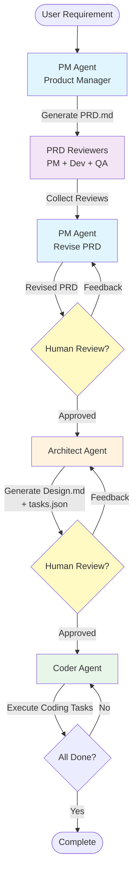

# AutoDev Agents

A LangGraph + Claude Code multi-agent system for automated software development.

English Documentation | [中文文档](README_CN.md)

## Overview

This project implements a Manager-Worker architecture where:
- **LangGraph** acts as the Manager (orchestrates workflow, manages state, makes routing decisions)
- **Claude Code CLI** acts as the Worker (executes coding tasks via CLI)

The system takes a requirement and generates:
1. Product Requirements Document (PRD) with multi-perspective review
2. Technical Design Document
3. Working code implementation

### Workflow Diagram



**Workflow Steps:**
1. **PM Agent** generates Product Requirements Document (PRD.md)
2. **PRD Reviewers** (PM + Dev + QA perspectives) review and provide feedback
3. **PM Agent** revises PRD based on reviewer feedback
4. Human review checkpoint: modify PRD or provide feedback
5. **Architect Agent** creates Technical Design (Design.md) and task breakdown (tasks.json)
6. Human review checkpoint: modify design or task list
7. **Coder Agent** loops through coding tasks until completion

## Project Structure

```
autodev-agents/
├── src/
│   └── autodev/                           # Main package
│       ├── __init__.py
│       ├── main.py                        # CLI entry point
│       ├── config/
│       │   ├── settings.py                # Configuration & env management
│       │   └── prompts.py                 # Agent prompt templates
│       ├── core/
│       │   ├── state.py                   # AgentState TypedDict
│       │   ├── graph.py                   # LangGraph workflow definition
│       │   └── checkpoint_manager.py      # Checkpoint setup
│       ├── agents/
│       │   ├── base.py                    # Base agent class
│       │   ├── pm_agent.py                # PRD generation & revision
│       │   ├── prd_reviewer_agents.py     # PRD reviewers (PM/Dev/QA)
│       │   ├── architect_agent.py         # Technical design
│       │   └── coder_agent.py             # Code execution loop
│       ├── tools/
│       │   ├── claude_cli.py              # Claude Code CLI wrapper
│       │   ├── file_ops.py                # File operations
│       │   └── validation.py              # Output validators (strict/lenient modes)
│       └── utils/
│           ├── logger.py                  # Structured logging
│           └── helpers.py                 # Utilities
├── data/                                  # Checkpoint & data storage
├── workspace/                             # Working directory for generated files
├── pyproject.toml
├── .env.example
└── README.md
```

## Installation

1. Clone the repository:
```bash
git clone <repository-url>
cd autodev-agents
```

2. Install in editable mode:
```bash
pip install -e .
```

3. Set up environment variables:
```bash
cp .env.example .env
# Edit .env and add your ANTHROPIC_API_KEY
```

## Usage

### Start a New Project

```bash
# Basic usage
autodev start "Build a simple Python CLI todo app with JSON storage"

# With human review enabled (pause after PRD and Design stages)
autodev start "Build a todo app" --human-loop

# Specify an existing project directory
autodev start "Add user authentication" --project-dir /path/to/project
```

### Resume from Checkpoint

```bash
# Continue workflow after providing feedback
autodev continue <session_id>

# Provide feedback to revise current stage
autodev continue <session_id> --feedback "Add more details to section 3"
```

### Check Status

```bash
# Show current state of a session
autodev status <session_id>

# Show artifacts (PRD, Design, or Tasks)
autodev show <session_id> --artifact prd
autodev show <session_id> --artifact design
autodev show <session_id> --artifact tasks
```

### List Sessions

```bash
# List all workflow sessions
autodev list-sessions
```

## PRD Review System

The system includes a three-perspective PRD review process:

### Reviewer Roles

| Reviewer | Perspective | Focus Areas |
|----------|-------------|-------------|
| **PM Reviewer** | Product Management | Requirement completeness, user value, business logic, user experience |
| **Dev Reviewer** | Development | Technical feasibility, implementation complexity, technical risks, design rationality |
| **QA Reviewer** | Testing | Testability, test coverage, quality standards, defect prevention |

### Review Process

1. Initial PRD generation by PM Agent
2. Parallel review by three specialist reviewers
3. PM Agent consolidates feedback and revises PRD
4. Human review checkpoint (optional with `--human-loop`)

### Review Artifacts

- `PRD.md` - Revised PRD document
- `PRD_Reviews.md` - Consolidated review feedback from all three perspectives

## Configuration

### Environment Variables

See `.env.example` for all configuration options:

| Variable | Description | Default |
|----------|-------------|---------|
| `ANTHROPIC_API_KEY` | Required for Claude API access | - |
| `DEFAULT_MODEL` | Model to use for agents | claude-3-5-sonnet-20241022 |
| `WORKSPACE_ROOT` | Directory for generated files | workspace |
| `DATA_ROOT` | Directory for checkpoints & data | data |
| `CLAUDE_CLI_TIMEOUT` | Timeout for Claude Code CLI commands | 300 |
| `CLAUDE_CLI_VALIDATION_MODE` | Task validation: `lenient` or `strict` | lenient |

### Validation Modes

**Lenient Mode** (default):
- Tolerates ambiguous output
- Focuses on success indicators
- Reduces false positives
- Recommended for development/iteration

**Strict Mode**:
- Requires clear success indicators
- Fails on ambiguous output
- Higher confidence in task completion
- Recommended for production/release

## Architecture

### Agents

1. **PM Agent**: Generates PRD from requirements, revises based on review feedback
2. **PRD Reviewers**: Three specialized reviewers (PM, Dev, QA perspectives)
3. **Architect Agent**: Creates technical design and task breakdown
4. **Coder Agent**: Executes coding tasks via Claude Code CLI

### Workflow

```
Requirement → [PM Agent] → PRD.md
           → [PM/Dev/QA Reviewers] → Reviews
           → [PM Agent Revise] → Revised PRD.md (human review)
           → [Architect Agent] → Design.md + tasks.json (human review)
           → [Coder Agent] → Code Implementation
```

## Claude Code CLI Integration

Coder Agent executes coding tasks by calling Claude Code CLI.

### Basic Command Format

```bash
claude --add-dir <work_dir> --permission-mode acceptEdits -p "<prompt>"
```

### Parameters

| Parameter | Description | Example |
|-----------|-------------|---------|
| `--add-dir` | Specify Claude Code working directory | `--add-dir /path/to/project` |
| `--permission-mode` | Auto-accept file edits | `--permission-mode acceptEdits` |
| `-p` | Prompt to execute | `-p "Create a user class"` |

### Working Directory Handling

1. **`--add-dir`**: Tells Claude Code which directory to work with
2. **`work_dir`**: Specifies the current working directory for command execution

These are typically set to the same path to ensure Claude Code operates in the correct directory.

## License

MIT
