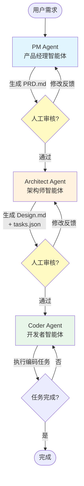

# AutoDev Agents - 智能软件开发系统

一个基于 LangGraph + Claude Code 的多智能体系统，用于自动化软件开发。

## 系统架构

系统采用 **管理者-工作者** 架构模式：

- **LangGraph** = 管理者（协调工作流、管理状态、做出路由决策）
- **Claude Code CLI** = 工作者（通过 CLI 执行实际编码任务）

### 工作流程图



**流程说明：**
1. **PM Agent** 生成产品需求文档 (PRD.md)
2. 人工审核点：可修改 PRD 或提供反馈
3. **Architect Agent** 创建技术设计文档 (Design.md) 和任务清单 (tasks.json)
4. 人工审核点：可修改设计或任务清单
5. **Coder Agent** 循环执行编码任务，直到所有任务完成

## 功能特性

系统接收用户需求，自动生成：
1. **产品需求文档 (PRD)** - 产品经理智能体
2. **技术设计文档** - 架构师智能体
3. **可工作的代码实现** - 开发者智能体

## 安装

### 1. 克隆项目

```bash
git clone <repository-url>
cd autodev-agents
```

### 2. 安装依赖

```bash
pip install -e ".[dev]"
```

### 3. 配置环境变量

复制示例配置文件并编辑：

```bash
cp .env.example .env
```

编辑 `.env` 文件，添加你的 API 配置：

```bash
# Anthropic API 配置
ANTHROPIC_API_KEY=your_api_key_here

# 如使用智谱AI或其他代理服务
ANTHROPIC_BASE_URL=https://open.bigmodel.cn/api/anthropic

# 模型配置
DEFAULT_MODEL=claude-3-5-sonnet-20241022
```

## 快速开始

### 方式一：使用 CLI 命令

#### 1. 启动新的工作流（全自动模式，默认）

```bash
# 默认全自动执行，无需人工审核
python -m src.main start "构建一个简单的Python CLI待办事项应用，支持添加、列表、完成和删除操作"
```

系统将自动完成：
1. 生成 PRD 文档
2. 生成技术设计文档
3. 执行代码实现

#### 2. 启用人工审核模式

```bash
# 添加 --human-loop 参数启用人工审核
python -m src.main start "构建一个简单的Python CLI待办事项应用" --human-loop
```

系统将在以下阶段暂停等待审核：
1. 生成 PRD 文档后暂停 → 审核后继续
2. 生成技术设计文档后暂停 → 审核后继续
3. 执行代码实现

#### 2. 继续工作流（审核后）

```bash
# 无需修改，直接继续
python -m src.main continue

# 提供反馈后继续
python -m src.main continue --feedback "请添加更多关于数据验证的细节"
```

#### 3. 查看会话状态

```bash
# 列出所有会话
python -m src.main list-sessions

# 查看特定会话状态
python -m src.main status <session_id>

# 查看生成的文档
python -m src.main show <session_id> --artifact prd
python -m src.main show <session_id> --artifact design
python -m src.main show <session_id> --artifact tasks
```

### 方式二：使用 Python 脚本

创建一个 Python 脚本：

```python
from src.core.graph import (
    create_workflow_session,
    run_workflow_until_interrupt,
    resume_workflow
)

# 1. 创建并运行工作流
requirement = "构建一个简单的Python计数器应用"
workflow, session_id, initial_state = create_workflow_session(
    requirement=requirement,
    human_in_loop=False  # 全自动模式（默认）
)

# 如需人工审核，设置 human_in_loop=True
# workflow, session_id, initial_state = create_workflow_session(
#     requirement=requirement,
#     human_in_loop=True  # 在 PRD 和 Design 阶段后暂停等待审核
# )

# 运行直到中断点
final_state, status, checkpoint = run_workflow_until_interrupt(
    workflow=workflow,
    initial_state=initial_state,
    session_id=session_id
)

print(f"状态: {status}")
if status == "interrupted":
    print(f"当前阶段: {final_state.get('stage')}")

# 2. 审核后继续
# 修改 workspace/{session_id}/ 中的文档
# 然后继续：
final_state, status, checkpoint = resume_workflow(
    workflow=workflow,
    session_id=session_id
)
```

## 工作流程详解

### 阶段 1: 需求分析 (PRD 生成)

**PM 智能体** 分析需求并生成产品需求文档。

**生成的文档结构：**
- 项目概述
- 用户故事
- 功能需求
- 非功能需求
- 数据需求
- 约束和假设
- 成功指标

**人工审核点：** 可以修改 PRD 或提供反馈以进行迭代。

### 阶段 2: 技术设计

**架构师智能体** 阅读 PRD 并创建：
- 技术设计文档
- 任务分解清单 (`tasks.json`)

**设计文档包含：**
- 架构概览
- 技术栈选择
- 系统设计（组件、数据模型）
- 文件结构
- 实现方法

**任务分解示例：**
```json
[
  {
    "id": "task_001",
    "title": "创建数据模型",
    "description": "实现 Todo 数据类",
    "dependencies": [],
    "status": "completed",
    "started_at": "2026-01-21T10:30:00.123456",
    "completed_at": "2026-01-21T10:30:45.678901",
    "duration": 45.56,
    "priority": 10
  },
  {
    "id": "task_002",
    "title": "实现存储层",
    "description": "创建 JSON 文件存储操作",
    "dependencies": ["task_001"],
    "status": "pending",
    "priority": 9
  }
]
```

**任务状态说明：**

| 字段 | 类型 | 说明 |
|------|------|------|
| `id` | string | 任务唯一标识符 |
| `title` | string | 任务标题 |
| `description` | string | 任务详细描述 |
| `dependencies` | array | 前置任务 ID 列表 |
| `status` | string | 任务状态：`pending` / `completed` / `blocked` |
| `started_at` | string | 任务开始时间 (ISO 8601 格式) |
| `completed_at` | string | 任务完成时间 (仅 completed 状态) |
| `blocked_at` | string | 任务阻塞时间 (仅 blocked 状态) |
| `duration` | number | 执行耗时（秒，保留 2 位小数） |
| `priority` | number | 任务优先级 |

**任务状态同步：**

系统会在每次任务状态变更时自动同步 `tasks.json` 到磁盘，确保工作流中断后可以正确恢复任务进度。状态更新时机：
- 任务开始执行时 → 记录 `started_at`
- 任务成功完成时 → 更新 `status` 为 `completed`，记录 `completed_at` 和 `duration`
- 任务执行失败时 → 更新 `status` 为 `blocked`，记录 `blocked_at` 和 `duration`

**人工审核点：** 可以修改设计文档或任务清单。

### 阶段 3: 代码实现

**开发者智能体** 执行编码任务：
- 循环遍历任务清单
- 为每个任务调用 Claude Code CLI
- 验证任务完成状态
- 更新任务进度

**代码输出位置：** `workspace/{session_id}/code/`

## 项目结构

```
autodev-agents/
├── workspace/                    # 工作目录
│   └── {session_id}/            # 会话目录
│       ├── PRD.md               # 产品需求文档
│       ├── Design.md            # 技术设计文档
│       ├── tasks.json           # 任务清单
│       └── code/                # 生成的代码
├── src/
│   ├── main.py                  # CLI 入口
│   ├── config/                  # 配置
│   ├── core/                    # 核心组件
│   ├── agents/                  # 智能体
│   ├── tools/                   # 工具
│   └── utils/                   # 工具函数
└── tests/                       # 测试
```

## 高级用法

### 启用人工审核模式

默认系统自动执行所有阶段。如需在 PRD 和 Design 阶段进行人工审核：

```bash
# 启用人工审核
python -m src.main start "需求描述" --human-loop

# 配合环境变量配置
HUMAN_IN_LOOP=true python -m src.main start "需求描述"
```

### 批量执行编码任务

```bash
python -m src.main start "需求描述" --batch-coding
```

### 使用不同模型

在 `.env` 文件中配置：

```bash
PM_MODEL=claude-3-5-sonnet-20241022
ARCHITECT_MODEL=claude-3-5-sonnet-20241022
CODER_MODEL=claude-3-opus-20240229
```

## 示例项目

### 示例 1: 简单计数器

```bash
python -m src.main start "构建一个Python计数器应用，支持增加、减少和重置操作"
```

### 示例 2: TODO CLI 应用

```bash
python -m src.main start "构建一个简单的Python CLI待办事项应用，使用JSON存储，支持添加、列表、完成和删除操作"
```

### 示例 3: REST API

```bash
python -m src.main start "构建一个Flask REST API，用于管理用户信息，支持CRUD操作"
```

## 配置选项

| 环境变量 | 说明 | 默认值 |
|---------|------|--------|
| `ANTHROPIC_API_KEY` | Anthropic API 密钥 | 必填 |
| `ANTHROPIC_BASE_URL` | API 基础 URL | `https://api.anthropic.com` |
| `DEFAULT_MODEL` | 默认模型 | `claude-3-5-sonnet-20241022` |
| `PM_MODEL` | PM 智能体模型 | `claude-3-5-sonnet-20241022` |
| `ARCHITECT_MODEL` | 架构师智能体模型 | `claude-3-5-sonnet-20241022` |
| `CODER_MODEL` | 开发者智能体模型 | `claude-3-5-sonnet-20241022` |
| `WORKSPACE_ROOT` | 工作目录 | `workspace` |
| `MAX_CODING_ITERATIONS` | 最大编码迭代次数 | `50` |
| `HUMAN_IN_LOOP` | 是否启用人工审核 | `false` (默认全自动) |
| `LOG_LEVEL` | 日志级别 | `INFO` |

## 测试

运行测试套件：

```bash
# 运行所有测试
pytest

# 运行特定测试
pytest tests/test_agents/
pytest tests/test_tools/

# 显示详细输出
pytest -v

# 运行系统测试
python test_system.py
```

## 故障排除

### API 连接失败

检查 `.env` 文件中的配置：
- `ANTHROPIC_API_KEY` 是否正确
- `ANTHROPIC_BASE_URL` 是否正确
- 网络连接是否正常

### Claude Code CLI 未找到

确保已安装 Claude Code CLI：
```bash
claude --version
```

如果未安装，参考 [Claude Code CLI 安装指南](https://github.com/anthropics/claude-code)

### 任务执行失败

检查日志文件：
```bash
cat logs/autodev.log
```

## 开发

### 代码风格

```bash
# 格式化代码
black src/ tests/

# 检查代码
ruff check src/ tests/

# 类型检查
mypy src/
```

### 添加新智能体

1. 在 `src/agents/` 下创建新文件
2. 继承 `LLMAgent` 或 `ToolAgent` 基类
3. 实现必要的方法
4. 在 `src/core/graph.py` 中添加节点

## 常见问题

**Q: 支持哪些编程语言？**

A: 理论上支持所有编程语言。系统会根据需求自动选择合适的技术栈。

**Q: 生成的代码质量如何？**

A: 代码质量取决于：
- 需求描述的清晰度
- 设计文档的完整性
- 任务的原子化程度

建议在人工审核阶段仔细检查设计文档。

**Q: 可以中途修改需求吗？**

A: 可以。在人工审核点，你可以：
- 修改生成的文档
- 提供反馈让系统重新生成
- 继续到下一阶段

**Q: 如何保存工作进度？**

A: 系统自动保存检查点到内存。所有生成的文档都保存在 `workspace/{session_id}/` 目录中。

## 许可证

MIT License
